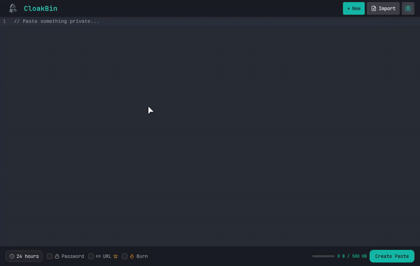

# CloakBin

<div align="center">


### Zero-Knowledge Encrypted Pastebin

**Your data is encrypted in your browser before it leaves your machine. The server only ever stores ciphertext.**

[](https://github.com/Ishannaik/CloakBin/stargazers)
[](https://www.gnu.org/licenses/agpl-3.0)
[](https://kit.svelte.dev/)
[](https://www.typescriptlang.org/)
[](https://discord.gg/KKvtRhQvRv)



[Live Demo](https://oss.cloakbin.com) • [Report Bug](https://github.com/Ishannaik/CloakBin/issues) • [Request Feature](https://github.com/Ishannaik/CloakBin/issues)

**Share a secret straight from your terminal. It encrypts on your machine before anything uploads:**

```sh
echo "my-api-key" | npx cloakbin
```

⭐ **Find CloakBin useful? [Star the repo](https://github.com/Ishannaik/CloakBin) so more people can find it.**

</div>

---

## Why Zero-Knowledge?

Traditional pastebins store your data in plaintext. Server admins, hackers, or anyone with database access can read everything you share.

**CloakBin encrypts everything in your browser before it reaches the server.**

```
┌─────────────────────────────────────────────────────────────────┐
│                     ZERO-KNOWLEDGE FLOW                         │
├─────────────────────────────────────────────────────────────────┤
│                                                                 │
│   YOUR BROWSER              SERVER                DATABASE      │
│   ────────────              ──────                ────────      │
│                                                                 │
│   "secret msg"                                                  │
│        │                                                        │
│        ▼                                                        │
│   ┌─────────┐                                                   │
│   │ ENCRYPT │  AES-256-GCM                                      │
│   │ locally │  (browser)                                        │
│   └────┬────┘                                                   │
│        │                                                        │
│        ▼                                                        │
│   "a3f8b2c1..."  ───────►  "a3f8b2c1..."  ───►  "a3f8b2c1..."  │
│   (ciphertext)             (ciphertext)         (ciphertext)    │
│                                                                 │
│   KEY stays in URL fragment (#)                                 │
│   example.com/p/abc#KEY    ◄── never sent to server             │
│                                                                 │
└─────────────────────────────────────────────────────────────────┘
```

The encryption key lives in the URL fragment (`#`), which **browsers never send to servers**. Steal our database and you get ciphertext you can't read.

## Security Model

| Component | What it sees |
|-----------|-------------|
| Your Browser | ✅ Plaintext (you control it) |
| Network/ISP | 🔒 Encrypted ciphertext only |
| CloakBin Server | 🔒 Encrypted ciphertext only |
| Database | 🔒 Encrypted ciphertext only |
| URL Recipient | ✅ Plaintext (they have the key) |

**Cryptographic Details:**
- **Encryption**: AES-256-GCM (authenticated encryption)
- **Key Derivation**: PBKDF2 with 100,000 iterations (for password-protected pastes)
- **Random Generation**: Web Crypto API (`crypto.getRandomValues`)

Full architecture write-up (ciphertext formats, fragment keys, threat model): **[docs/SECURITY-MODEL.md](docs/SECURITY-MODEL.md)**. Vulnerability reporting: **[SECURITY.md](SECURITY.md)**.

## Verify the Zero-Knowledge Claim Yourself

You can check the guarantee yourself, in your browser:

1. Open your browser's **DevTools** (F12) and switch to the **Network** tab.
2. Type some text and **create a paste**.
3. Inspect the outgoing `POST` request that saves the paste and look at its **request body**. You'll see only **ciphertext** and a **salt**, never your plaintext, and never the encryption key.
4. Look at the resulting paste URL: the decryption key is the part after the `#` (the **URL fragment**). By web standard, browsers **never send the fragment to the server**. It stays client-side.
5. Open the paste and watch the Network tab again: the server returns the stored **ciphertext**, and decryption happens **in your browser** using the key from the `#fragment`.

The key exists only in the fragment and in your recipient's browser. The server, its database, and anyone on the network see encrypted blobs. No server-side code path can read your content, so a subpoena turns up ciphertext and nothing more.

## Features

- 🔐 **Zero-Knowledge Encryption** - AES-256-GCM, keys never leave your browser
- 🔑 **Password Protection** - Optional second layer with PBKDF2
- 🔥 **Burn After Read** - Self-destructing pastes
- ⏰ **Flexible Expiration** - 1 hour to never
- 🎨 **Syntax Highlighting** - 50+ languages auto-detected
- 🚫 **No Tracking** - No analytics, no cookies, no accounts
- 📱 **Responsive** - Works on desktop and mobile

## Quick Start

```bash
# Clone
git clone https://github.com/Ishannaik/CloakBin.git
cd CloakBin

# Install
pnpm install

# Configure
cp .env.example .env
# Edit .env with your MongoDB URI

# Run
pnpm dev
```

Open [http://localhost:5173](http://localhost:5173)

### Type coverage

CI runs `pnpm run type-coverage` to catch regressions in typed source coverage.
The current source baseline is 93.22%, with generated `.svelte-kit` route types ignored,
so the gate fails below 93%.

## Environment Variables

```env
MONGODB_URI=mongodb://localhost:27017/cloakbin
ADMIN_USER=admin
ADMIN_PASS=your-secure-password
```

## Tech Stack

| Layer | Technology |
|-------|------------|
| Framework | SvelteKit 2.0, Svelte 5 |
| Language | TypeScript |
| Styling | Tailwind CSS 4.0 |
| Database | MongoDB |
| Encryption | Web Crypto API |
| Editor | CodeMirror 6 |
| Hosting | Vercel |

## Project Structure

```
src/
├── lib/
│   ├── components/     # UI components
│   ├── db/             # Database adapters
│   └── crypto.ts       # Encryption (AES-256-GCM, PBKDF2)
├── routes/
│   ├── +page.svelte    # Create paste
│   ├── p/[id]/         # View paste
│   ├── api/            # REST endpoints
│   └── admin/          # Admin dashboard
└── app.html
```

## Self-Hosting

CloakBin is open source. Deploy your own instance:

1. Fork this repository
2. Deploy to Vercel/Netlify/your server
3. Set up MongoDB (Atlas free tier works)
4. Configure environment variables

### Health Check

For container orchestrators (Docker, Kubernetes, Fly.io, Railway, etc.) to monitor readiness and trigger restarts:

**Healthy** — `200`:
```json
{ "ok": true, "db": "mongodb" }
```

**Unhealthy** — `503` (e.g. database unreachable):
```json
{ "ok": false, "error": "database unavailable" }
```

This endpoint is excluded from rate limiting so orchestrators can poll it frequently.

## Deploy CloakBin at your company

CloakBin is free to self-host. If you want it running on your own infrastructure without doing the setup yourself, I can handle it for you.

I cover deployment, custom domains, SSO, security hardening, and ongoing support, priced to what your team needs. This is a paid engagement.

Email me at [ishannaik7@gmail.com](mailto:ishannaik7@gmail.com) with your requirements and I'll send a quote.

## Contributing

PRs welcome! Please:

1. Fork the repo
2. Create a feature branch
3. Make your changes
4. Submit a PR

Ask questions or swap ideas with other contributors on [Discord](https://discord.gg/KKvtRhQvRv).

## Acknowledgments

- [PrivateBin](https://privatebin.info/) - Zero-knowledge inspiration
- [CodeMirror](https://codemirror.net/) - Editor component
- [Lucide](https://lucide.dev/) - Icons

## Contributors

[](https://github.com/Ishannaik/CloakBin/graphs/contributors)

## Star Gazers

[](https://github.com/Ishannaik/CloakBin/stargazers)

## License

GNU Affero General Public License v3.0 (AGPL-3.0) - see [LICENSE](LICENSE)

If you run a modified version of CloakBin as a network service, AGPL §13 requires you to offer the modified source to your users.

---

<div align="center">

Made by [Ishan Naik](https://github.com/Ishannaik)

</div>
